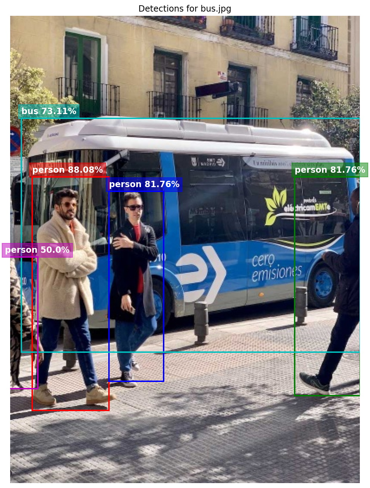

# YOLOv26n: Optimized QAT & Deployment on ESP32-P4


This repository provides an end-to-end workflow for **Quantization Aware Training (QAT)**, Export, and Deployment of **YOLOv26n** (NMS-Free) on the **ESP32-P4** SoC using the ESP-DL library.

By leveraging a custom dual-head architecture and direct regression (`RegMax=1`), this implementation achieves high-performance inference without the overhead of Distribution Focal Loss (DFL) or complex post-processing.

> [!TIP]
> **Accuracy Parity & Speed Leadership:** This implementation achieves a **36.5% mAP** matching the official ESP-DL YOLOv11nbut runs **30% faster** thanks to hardware-specific SIMD kernels.

### Benchmark Comparison
| Architecture | Resolution | mAP (Accuracy) | Latency | Speedup |
| :--- | :---: | :---: | :---: | :---: |
| ESP-DL YOLOv11n | 640px | 36.0% | 2.4s | 1.0x |
| **YOLO26n (Ours)** | **512px** | **36.5%** | **1.7s** | **1.3x (🚀 +30%)** |

---

<div align="center">
  
  ### Technical Case Study
  **Want to see how I achieved 1.7s latency on ESP32-P4?**
  
  [](https://boumedinebillal.github.io/my_profile/project-viewer.html?id=yolo26n-esp32p4)
  
  *⏱️ 5 Minute Read • 🧠 Deep Tech Analysis*

</div>

---
<br>

> [!IMPORTANT]
> ### 🚀 Upcoming Feature: Instance Segmentation (YOLO26n-Seg)
> 
> I am actively developing the **YOLO26n-Seg** port for ESP32-P4. Unlike standard detection, this will enable **real-time pixel-level mask generation**, allowing for precise object boundary separation on the edge.
>
> **🔒 Unlock Condition:**
> I will open-source the full Segmentation Pipeline (QAT + C++ Deployment) once this repository reaches **200 Stars ⭐**.
>
> *Help me reach this milestone by starring the project!*

<br>
---

<div style="margin-bottom: 25px;">
    <h3 style="border-bottom: none; margin-bottom: 10px; color: #fbfbfb;">Bus Detection Analysis</h3>
    
</div>


## Installation & Setup

This project requires the **ESP-DL** library to be located in the project root.

### 1. Clone Repository
```bash
git clone https://github.com/boumedinebillal/yolo26n_esp.git
cd yolo26n_esp
```

### 2. Install ESP-DL Library
The project relies on `esp-dl` for neural network kernels. Clone it into the root directory:

```bash
git clone https://github.com/espressif/esp-dl.git
cd esp-dl
git submodule update --init --recursive
```

> **Troubleshooting / Version Lock:**
> While the latest version is recommended, if you encounter build errors, revert to the validated commit:
> ```bash
> git checkout 7089b94a76206825bddba57a6385d46cc08c0a6b
> git submodule update --init --recursive
> ```

Return to the project root:
```bash
cd ..
```

### 3. Install Python Dependencies
Ensure you have Python >3.9 installed.
```bash
pip install -r requirements.txt
```

### Comparative Results (ESP32-P4)

Benchmark conducted on ESP32-P4 Engineering Sample.

| Model Architecture | Configuration | Resolution | mAP (COCO) | Latency | Status |
| :--- | :--- | :--- | :--- | :--- | :--- |
| **YOLO26n (Optimized)** | **Int8 QAT** | **512x512** | **36.5%** | **1.77s** | **Target** |
| YOLO26n (High-Res) | Int8 QAT | 640x640 | 38.5% | 3.00s | |
| YOLOv11n (Baseline) | Official ESP-DL | 640x640 | 36.0% | 2.75s | |

## Key Features

-   **NMS-Free Architecture**: Utilizes a One-to-One prediction head for direct inference, eliminating the need for Non-Maximum Suppression.
-   **Int8 Quantization**: Full Quantization Aware Training (QAT) pipeline using `esp-ppq` for maximum efficiency on the P4 accelerator.
-   **Dynamic Resolution**: Pre-configured support for both 512x512 and 640x640 resolutions in firmware.
-   **Optimized Firmware**: C++ Inference engine (`Yolo26Processor`) optimized for ESP-DL's static graph execution.

## Usage Pipeline

The entire QAT and Export workflow is orchestrated by `YOLOv26_QAT_Workflow.ipynb`.

1.  **Open the Notebook**:
    ```bash
    jupyter notebook YOLOv26_QAT_Workflow.ipynb
    ```
2.  **Configure**: Set your desired `IMG_SZ` (512 or 640) in the configuration cell.
3.  **Run Pipeline**: Execute all cells to:
    -   Export the PyTorch model to ONNX (with custom patches).
    -   Quantize and Calibrate using `esp-ppq`.
    -   Fine-tune (QAT) for optimal accuracy.
    -   Export the final `.espdl` model artifacts.
4.  **Artifacts**: The resulting models will be saved in `output/size_512/` or `output/size_640/`.

## Firmware Deployment

The ESP-IDF firmware project is located in `yolo26n_esp32p4/`.

### Prerequisites
-   **ESP-IDF v5.5+** installed and sourced.

### Deploying a New Model
After running the QAT pipeline:
1.  Copy the generated `.espdl` file from `output/` to `yolo26n_esp32p4/main/models/`.
2.  Review `yolo26n_esp32p4/README.md` for specific build switches (e.g., selecting 512 vs 640 model).

### Build & Flash
```bash
cd yolo26n_esp32p4
idf.py set-target esp32p4
idf.py build
idf.py flash monitor
```

## Project Structure

```text
.
├── yolo26n_esp32p4/      # ESP-IDF C++ Firmware Project
├── pipeline_source/      # Python Source (Trainer, Exporter, Config)
├── output/               # Generated Models & Checkpoints
├── YOLOv26_QAT_Workflow.ipynb # Main QAT Orchestrator
├── requirements.txt      # Python Dependencies
└── README.md             # Project Documentation
```

## License

This project is licensed under the MIT License - see the [LICENSE](LICENSE) file for details.

Copyright (c) 2026 Billal Boumedine (https://github.com/boumedinebillal/yolo26n_esp)


## Citation

If you use this work in your research or project, please cite:

```bibtex
@software{yolo26n_esp32p4,
  author = {Boumedine, Billal},
  title = {YOLO26n QAT & Deployment for ESP32-P4},
  year = {2026},
  publisher = {GitHub},
  journal = {GitHub repository},
  howpublished = {\url{https://github.com/boumedinebillal/yolo26n_esp}}
}
```

## Contact

www.linkedin.com/in/boumedine-billal-a9a850239

Open an issue for bug reports or feature requests.

Pull requests are welcome!
