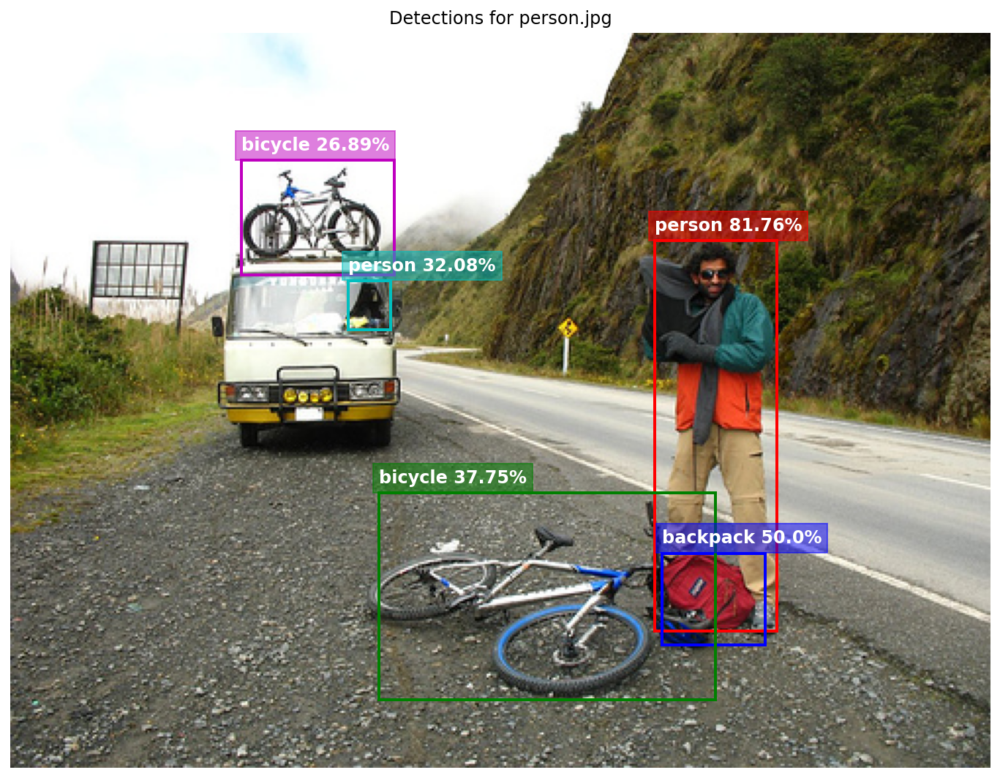

# YOLOv26n Inference Firmware (ESP32-P4)

This folder contains the ESP-IDF project for running YOLOv26n inference on the ESP32-P4.

## Features
- **NMS-Free Decoding**: Implements custom C++ decoding for YOLOv26's One-to-One head.
- **Quantization Support**: Runs the quantized `.espdl` models exported from the QAT pipeline.
- **Dual Model Support**: Pre-configured for both 512x512 and 640x640 input sizes.

## Model Configuration

The project supports two model resolutions: **512x512 (Default)** and **640x640**.

### Switching Models
To switch between models, you need to edit `main/CMakeLists.txt`:

1.  Open `main/CMakeLists.txt`.
2.  Locate the `EMBED_FILES` definition.
3.  Change the path to your desired model:
    ```cmake
    # For 512x512
    set(embed_files models/yolo26n_512.espdl ...)
    
    # For 640x640
    set(embed_files models/yolo26n_640.espdl ...)
    ```
4.  **Note**: The Input and Output processors now automatically detect the input dimensions and calculate the correct output shapes, so manual configuration is not required.

## Building and Flashing

1.  **Set Target**:
    ```bash
    idf.py set-target esp32p4
    ```

2.  **Build**:
    ```bash
    idf.py build
    ```

3.  **Flash and Monitor**:
    ```bash
    idf.py -p COMx flash monitor
    ```
    *(Replace `COMx` with your specific serial port)*

## Expected Output

```text
======================================================================
  YOLOv26n Inference Demo v3 (Refactored Processor)
======================================================================
W (1743) FbsLoader: The address of fbs model in flash is not aligned with 16 bytes.

=== Testing: bus.jpg ===
Timings:
  Pre-process:  20 ms
  Inference:    1780 ms
  Post-process: 10 ms
  Total:        1810 ms

--- Top Detections ---
Det 1: person (88.08%) | Box: [32.0, 176.0, 144.0, 432.0]
Det 2: person (81.76%) | Box: [144.0, 192.0, 224.0, 400.0]
Det 3: person (81.76%) | Box: [416.0, 176.0, 512.0, 416.0]
Det 4: bus (73.11%) | Box: [16.0, 112.0, 512.0, 368.0]
Det 5: person (50.00%) | Box: [-8.0, 264.0, 40.0, 408.0]

=== Testing: person.jpg ===
Timings:
  Pre-process:  30 ms
  Inference:    1770 ms
  Post-process: 10 ms
  Total:        1810 ms

--- Top Detections ---
Det 1: person (81.76%) | Box: [336.0, 144.0, 400.0, 416.0]
Det 2: backpack (50.00%) | Box: [340.0, 362.0, 394.0, 426.0]
Det 3: bicycle (37.75%) | Box: [192.0, 320.0, 368.0, 464.0]
Det 4: person (32.08%) | Box: [176.0, 172.0, 198.0, 206.0]
Det 5: bicycle (26.89%) | Box: [120.0, 88.0, 200.0, 168.0]

=== Test Complete ===
```

### Visualization Guide

You can visualize these text results using the provided python script `main/visualize_esp32_output.py`.

1.  Copy the raw terminal output (like above).
2.  Paste it into the `RAW_LOG_DATA = """ ... """` variable inside the Python script.
3.  **Crucial**: Update the `MODEL_WIDTH` and `MODEL_HEIGHT` variables in `visualize_esp32_output.py` to match your model size (e.g., 512 or 640) for correct scaling.
4.  Run the script to generate annotated images.

## Visualized Results

<div style="margin-bottom: 25px;">
    <h3 style="border-bottom: none; margin-bottom: 10px; color: #fbfbfb;">Bus Detection Analysis</h3>
    
</div>


<div style="margin-bottom: 25px;">
    <h3 style="border-bottom: none; margin-bottom: 10px; color: #ffffff;">Person Detections</h3>
    
</div>


